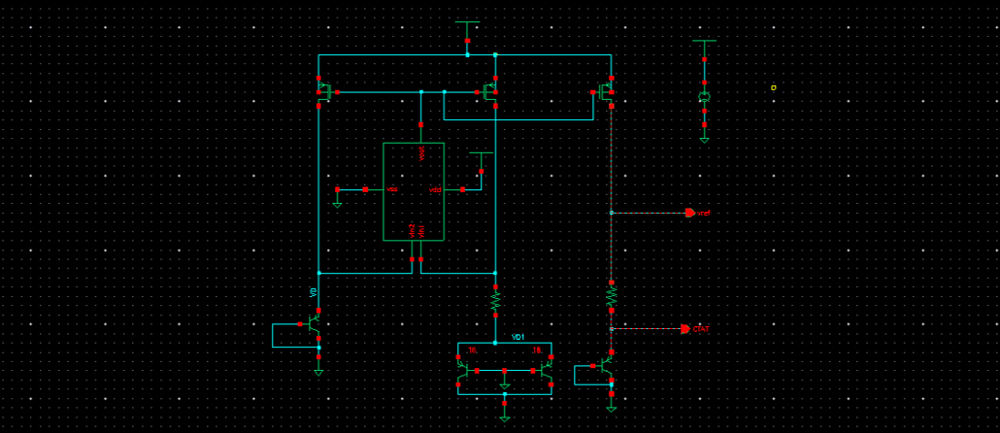
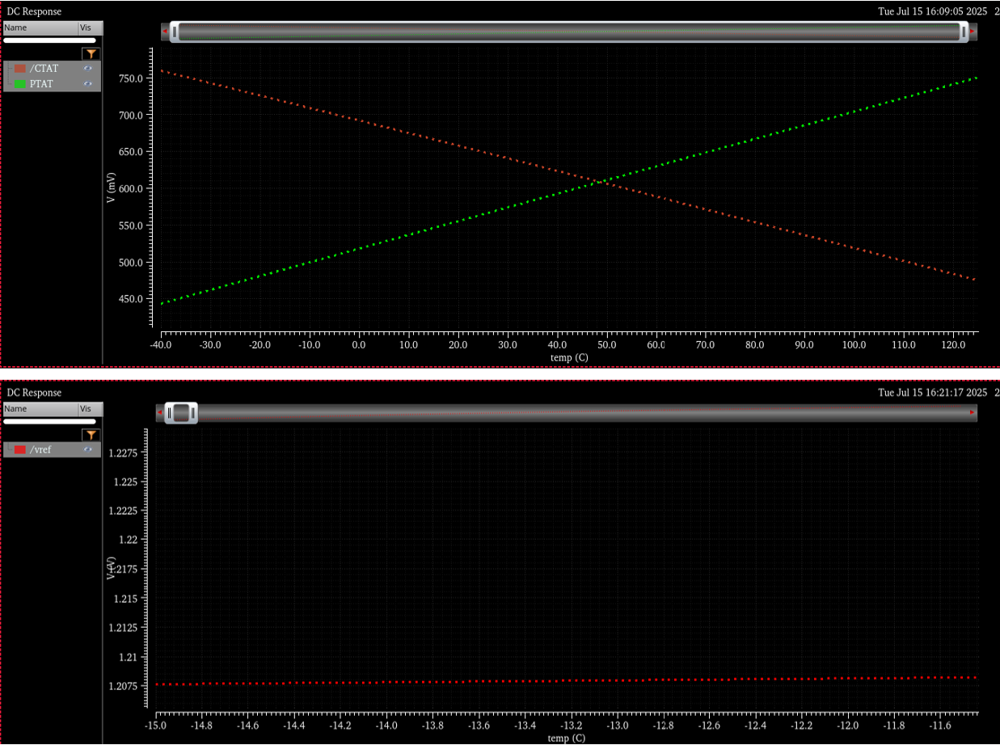
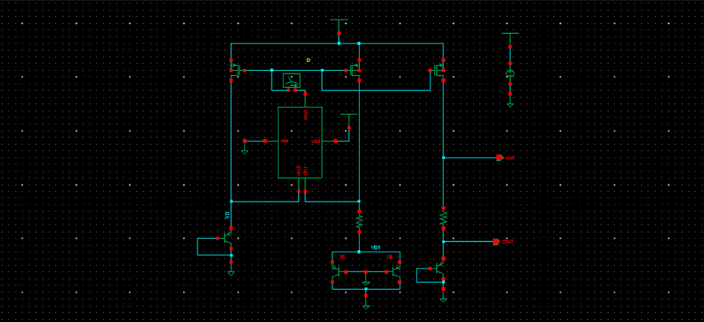
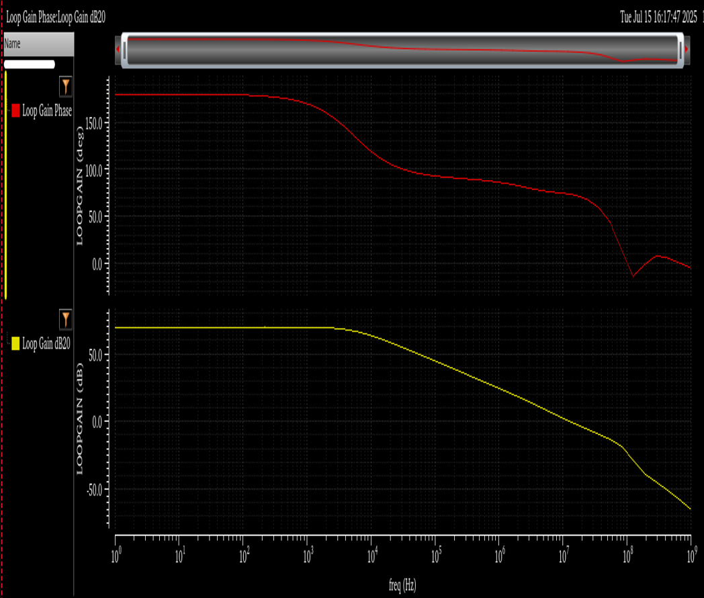

## Bandgap Reference (BGR)
Generates a temperature-independent reference voltage (~1.2 V) by combining PTAT and CTAT voltages. Bias-independent and process-stable, suitable for ADCs, LDOs, and op-amps.  

### Circuit

### PTAT & CTAT Graphs
  

### Closed Loop Stability Analysis  
Loop gain is the product of amplifier gain and feedback factor. An `iprobe` is placed in the feedback path to measure loop gain for AC analysis without affecting biasing. 
 

### AC Analysis
  

**Results Table:**  
| Parameter        | Value/Observation |
|------------------|-------------------|
| Gain             | 69.85 db |
| Phase Margin     | 75.55° |
| Gain Margin      | 21.46 db |
| Temp Coefficient | 23.1 ppm/°C |

