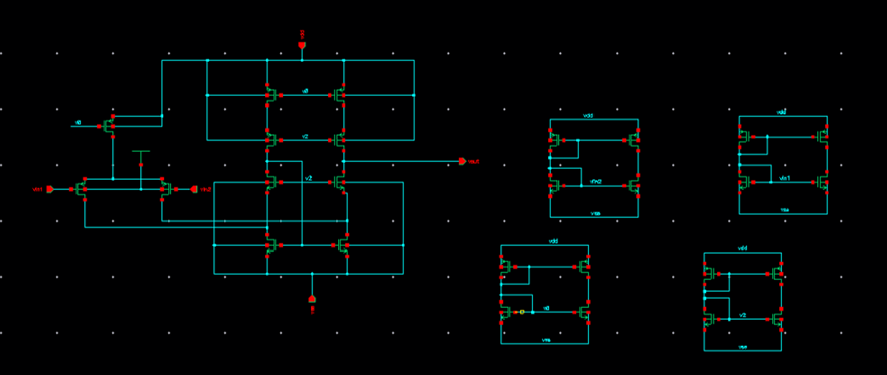
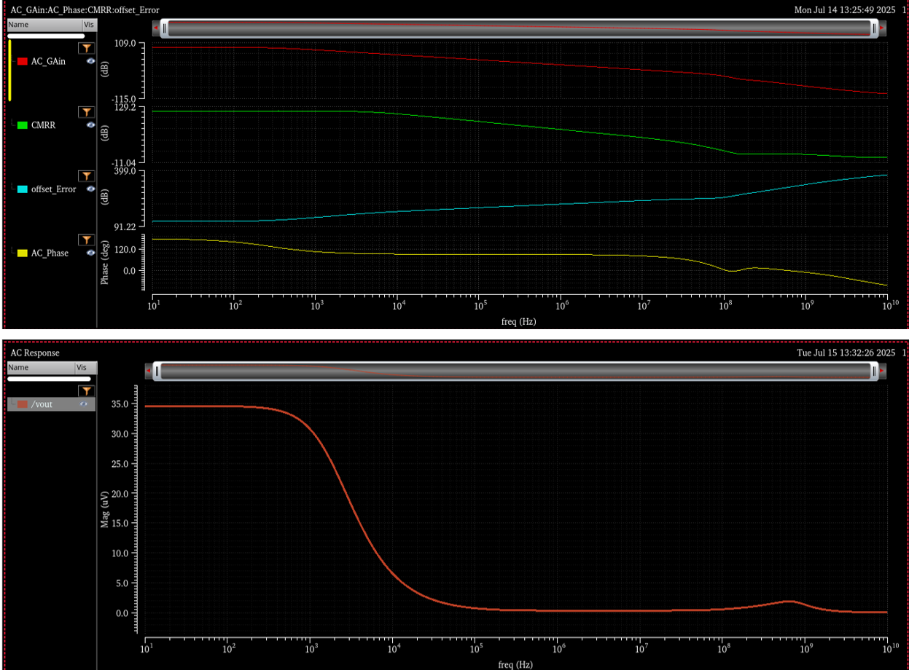
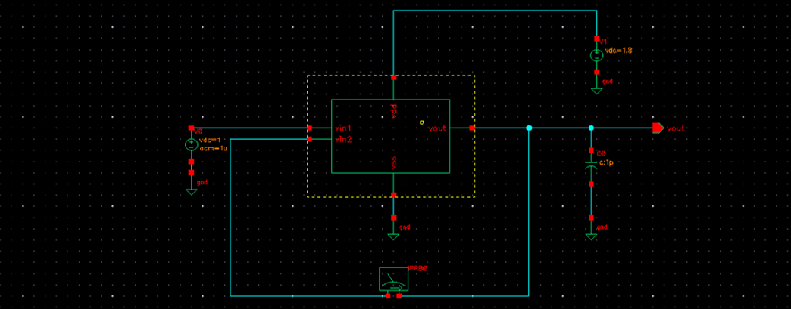
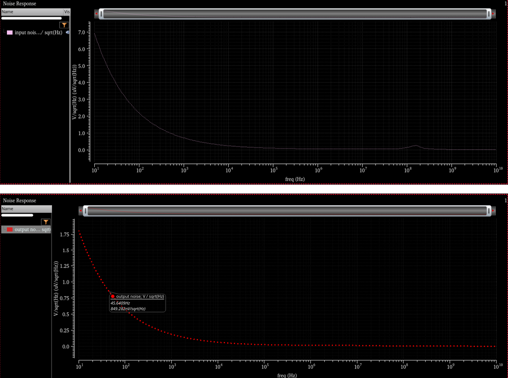
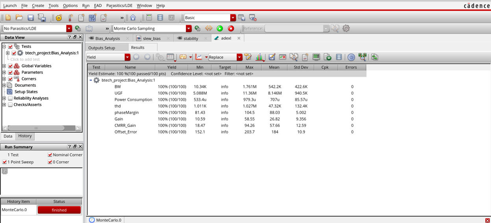
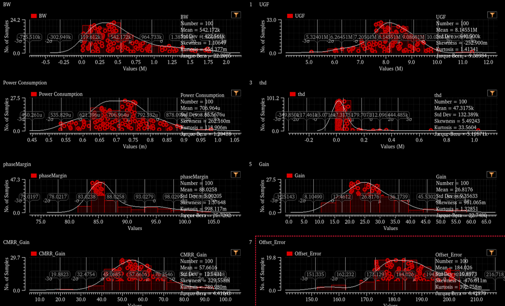
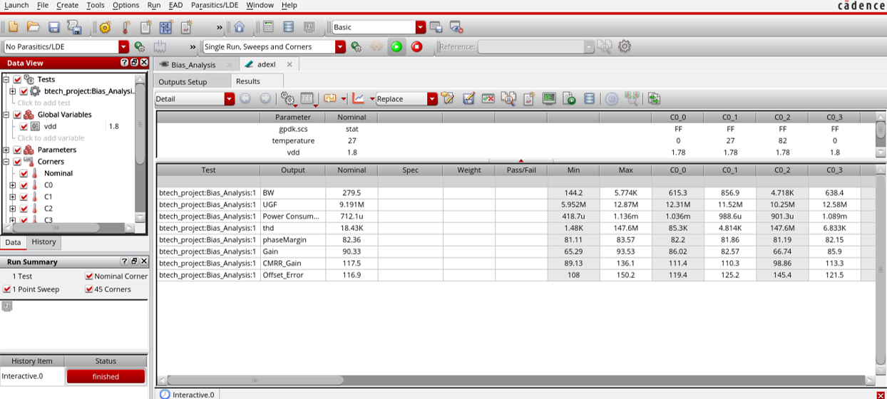
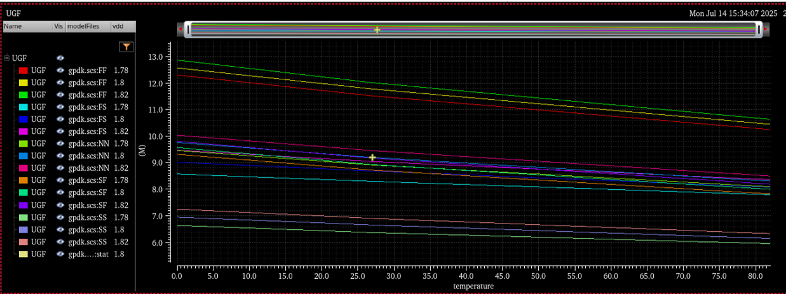
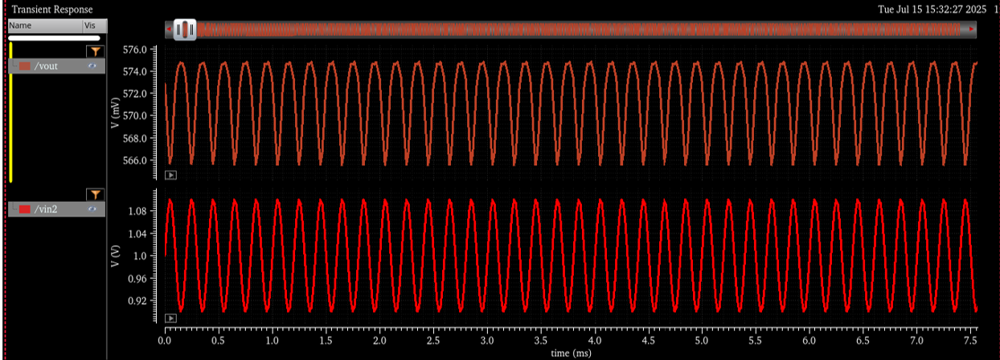

## Biased Folded Cascode Op-Amp
Enhances gain and allows higher output swing. Uses current mirrors for bias generation and load to ensure current matching. Cascoding and high output impedance contribute to high gain.  

### Circuit
  

### AC Analysis
  

### Noise Analysis  
- High noise at low frequencies due to flicker (1/f) noise.  
- Flat noise at high frequencies indicates thermal noise dominance.  
- Output noise is significantly lower than input noise, showing good noise suppression.  
- Biasing improves transconductance, reduces noise, and ensures saturation.  

  

### Monte Carlo Analysis  
- Bandwidth and gain bandwidth within limits.  
- Power in µW range with minimal variation.  
- Phase margin ~ 88° (high stability).  
- Gain stable with low deviation.  
- CMRR ~ 57 dB (good noise immunity).  
- Offset error: 184 µV (very low).  

  

### PVT Analysis

  

### Transient Analysis  
Output is a clean sine wave with no distortion or clipping. Slightly higher amplitude than input confirms gain. No ringing, overshoot, or drift observed. OTA is biased at ~571 mV and operates in the linear region.  
  

**Results Table:**  
| Parameter            | Value/Observation |
|----------------------|-------------------|
| Gain                 | 90.3 db |
| Bandwidth            | 279.5 Hz |
| UGB                  | 9.19 MHz |
| CMRR                 | 117.52 db |
| Slew Rate            | 3.28 MV/s |
| THD                  | 0.262% |
| Phase Margin         | 82.36° |
| Power Comsumption    | 177.76 µW |
| Offset Voltage Error | 116.9 V |
| Noise                | 3.47e^-14 V/sqrt(Hz) |
