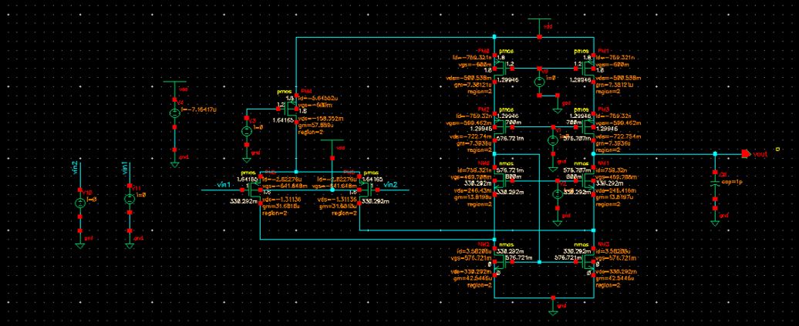
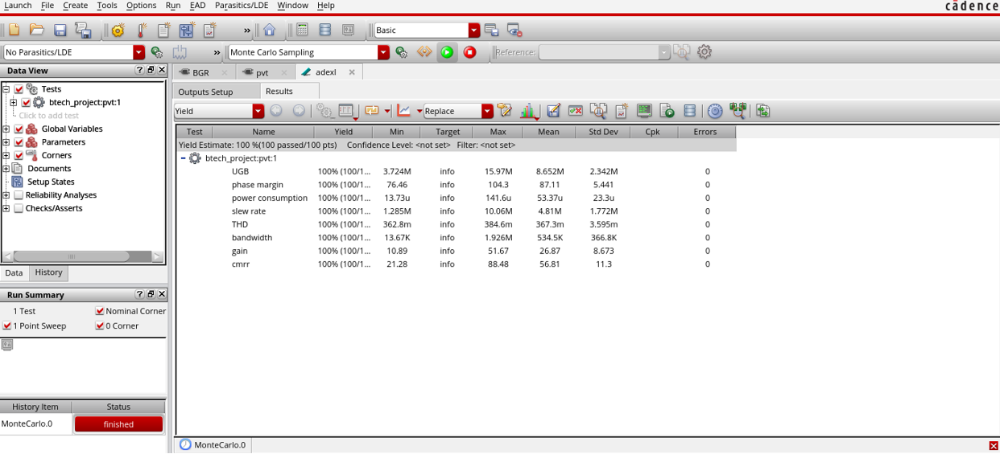
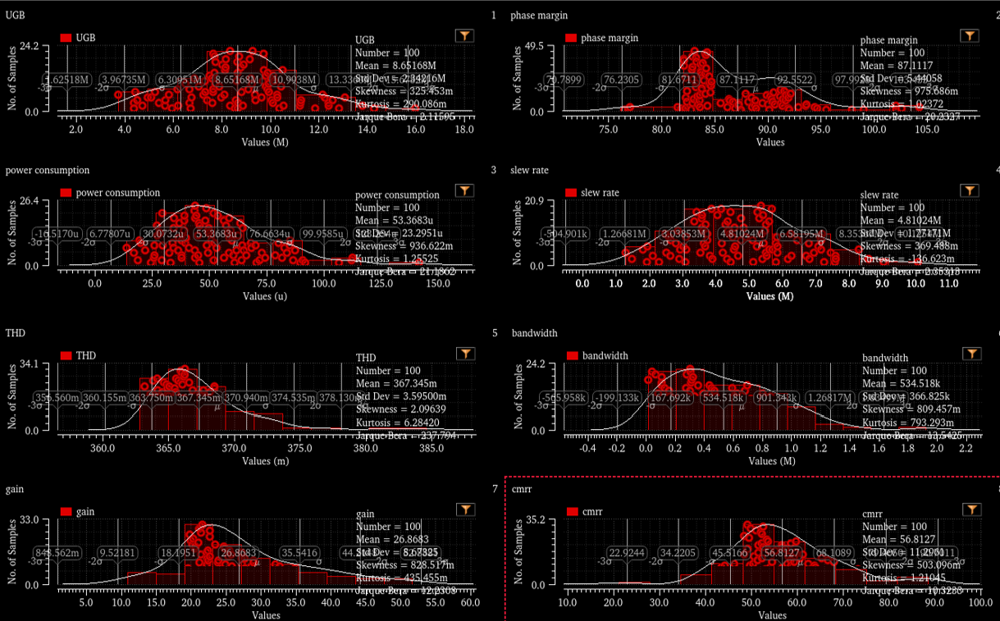
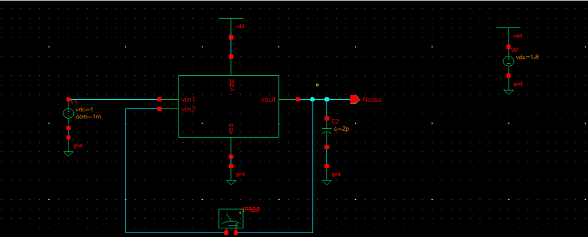
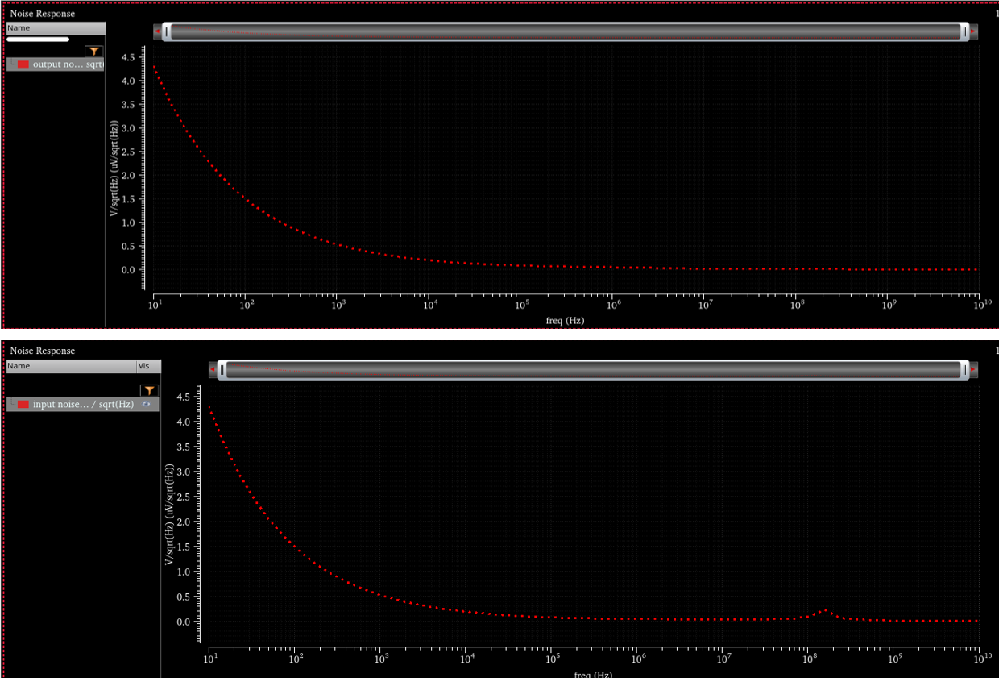
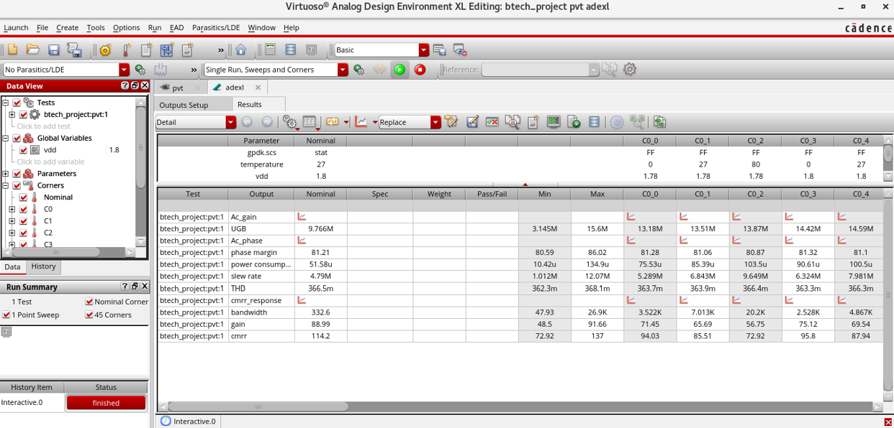
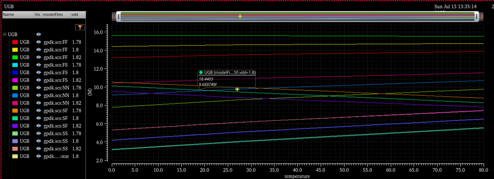

## Folded Cascode Op-Amp
Uses a folded structure to route current from the input differential pair to the cascode load. Improves output swing compared to telescopic op-amp while providing high gain. More complex biasing is required due to folding. All transistors are biased in saturation.  

### Circuit

### Symbols

### AC Analysis
  

### Monte Carlo Analysis  
- UGB mean = 8.65 MHz (stable bandwidth).  
- Power = 33.7 µW (low consumption).  
- Slew rate mean = 48.1 MV/s (fast response).  
- Phase margin mean = 87.1° (excellent stability).  
- CMRR mean = 56.8 dB (good noise rejection).  

  

### Noise Analysis  
- Noise sources: input pair, current mirrors, bias branches.  
- Flicker noise dominates at low frequency; thermal noise dominates at higher frequency. 
   
  

### PVT Analysis  
- Power: ~33.7 µW.  
- Slew rate: ~47.9 MV/s.  
- Bandwidth: ~336 kHz.  
- CMRR: ~85 dB (excellent).  
  
  

**Results Table:**  
| Parameter            | Value/Observation |
|----------------------|-------------------|
| Gain                 | 89.36 db |
| Bandwidth            | 332.615 Hz |
| UGB                  | 9.766 MHz |
| CMRR                 | 114.168 db |
| Slew Rate            | 4.79 MV/s |
| THD                  | 0.366% |
| Phase Margin         | 81.20° |
| Power Comsumption    | 12.89 µW |
| Noise                | 5.27e^-17 V/sqrt(Hz) |
