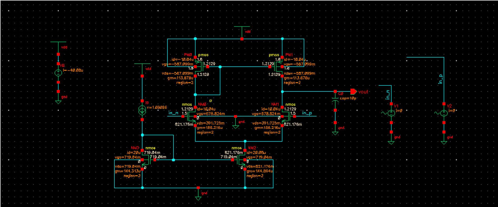
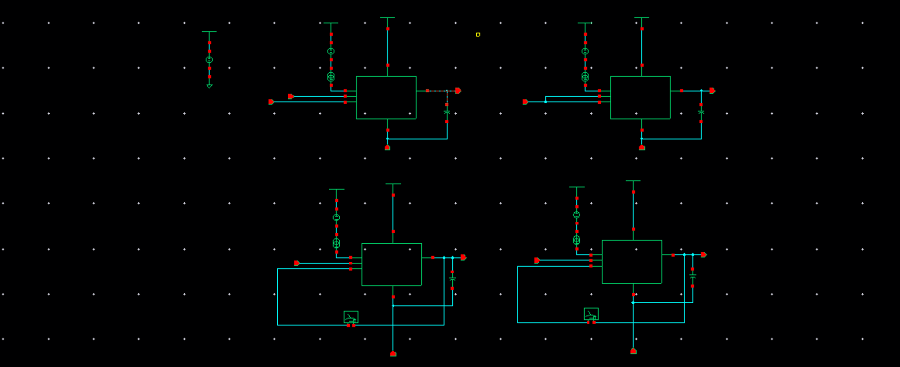
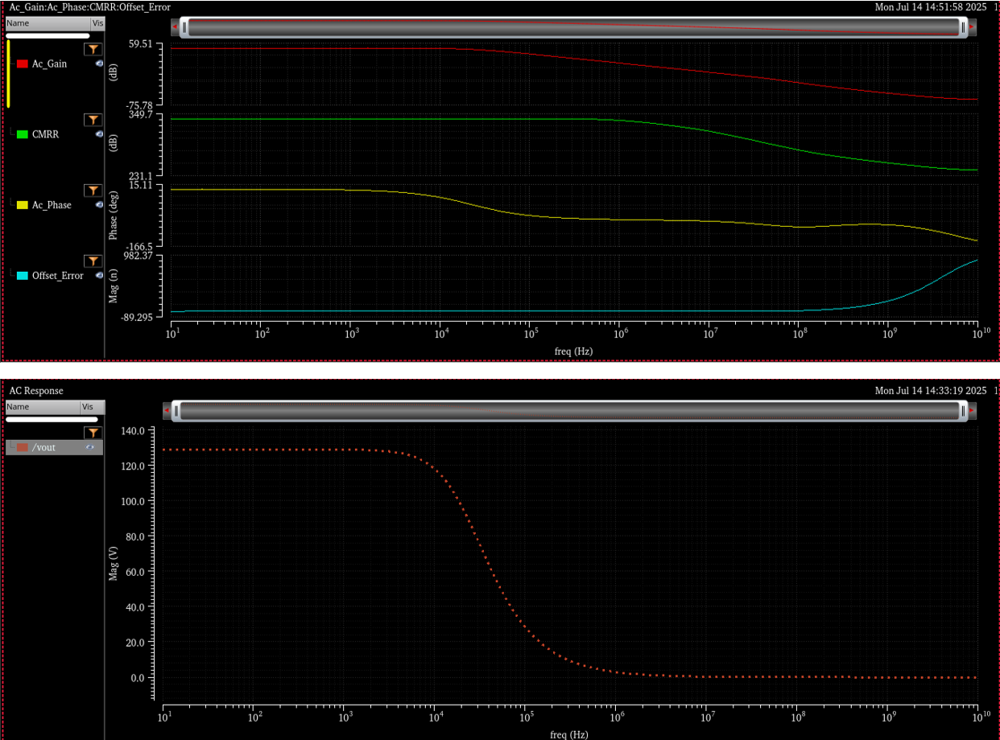
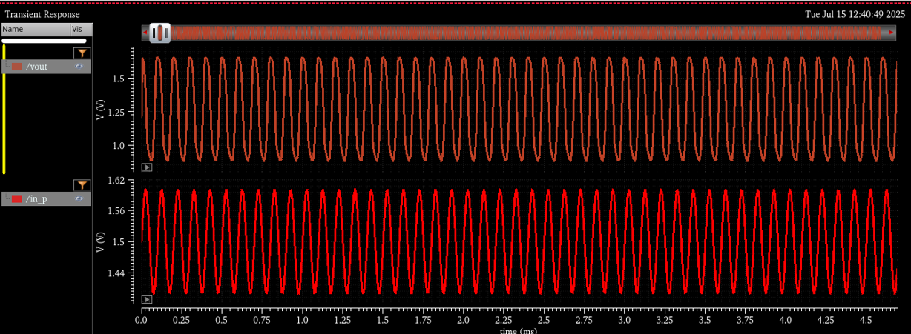
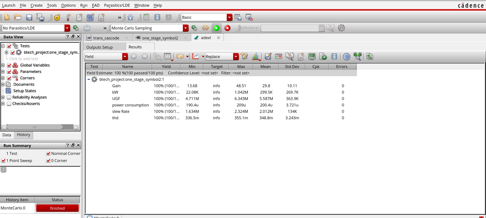
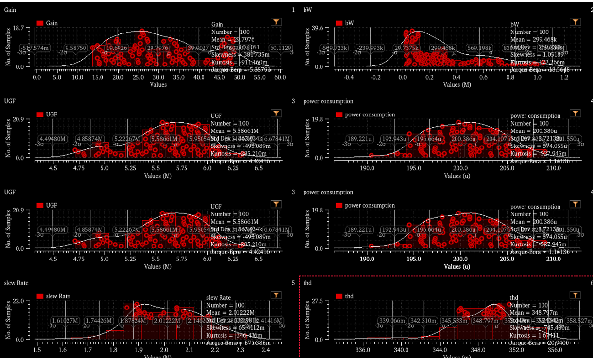
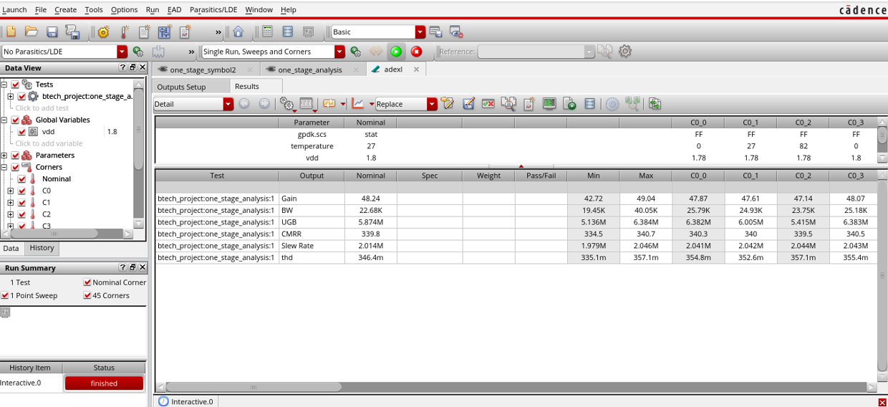
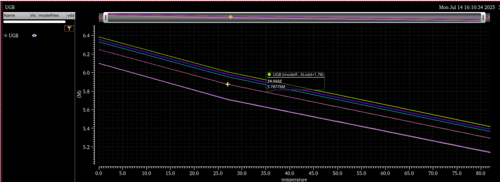

## One-Stage Op-Amp
Single differential pair with active load (PMOS/NMOS current mirror). Bias current is supplied via a tail current source, typically implemented using a current mirror. This configuration is faster than a two-stage op-amp due to fewer internal nodes. All transistors are biased in saturation.  

**Target Design Criteria:**  
- Use `iprobe` to measure slew rate and THD without disturbing DC bias.  
- Perform `stb` analysis for phase and gain margins.  
- Aim for phase margin >= 45° and gain margin >= 10 dB.  

### Circuit
  

### Symbol
  

### AC Analysis
  

### Transient Analysis  
Input pulse: delay = 1 µs, amplitude = 100 mV, frequency = 10 kHz, DC bias = 1.5 V. Slew rate and settling time were measured from the output waveform. Output swing remained within expected range. Minimal overshoot was observed, indicating good stability.  
  

### Monte Carlo Analysis  
All 100 samples met specifications, showing robustness to mismatch.  
- Gain mean = 29.8, std. dev. = 10.11 (moderate variation due to differential pair mismatch).  
- UGF ~ 5.6 MHz with tight spread (stable frequency response).  
- Power ~ 200 µW with very low variation (well-controlled biasing).  
- Slew rate ~ 2 MV/s (good dynamic performance).  

  

### PVT Analysis  
Corners: FF, TT, SS, NN, SF at 0°C, 27°C, 82°C, VDD = 1.8 V.  
- Gain: 42.7 - 49 (stable across corners).  
- UGB: 5.13 MHz - 6.38 MHz (within target).  
- CMRR: ~334 - 340 dB (consistent).  
- Slew rate: ~2 MV/s (good response).  
- THD: ~335M - 357M (good linearity).  
 
  

**Results Table:**  
| Parameter            | Value/Observation |
|----------------------|-------------------|
| Gain                 | 48.23 db |
| Bandwidth            | 22.68 KHz |
| UGB                  | 5.87 MHz |
| CMRR                 | 339 db |
| Slew Rate            | 2.01 MV/s |
| THD                  | 0.346% |
| Phase Margin         | 89.39° |
| Power Comsumption    | 50 µW |
| Offset Voltage Error | 10.20 pV |
| Noise                | 7.87e^-15 V/sqrt(Hz) |
