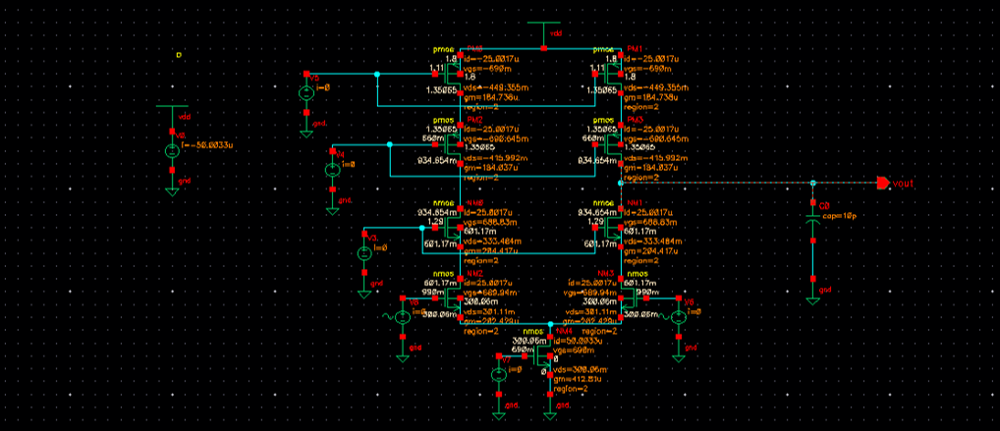
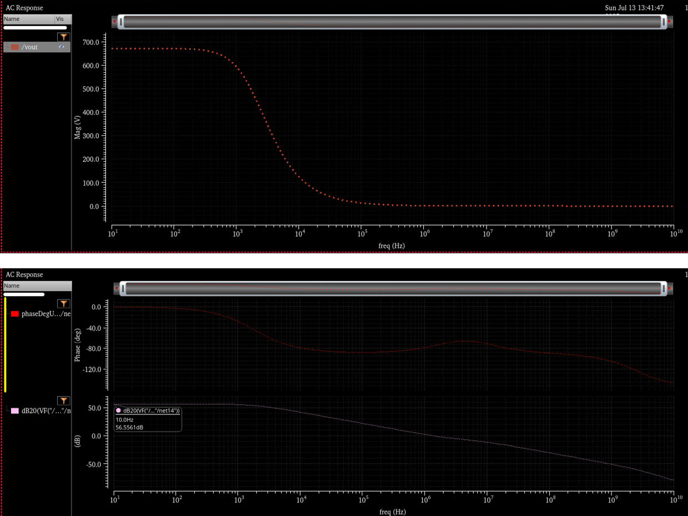
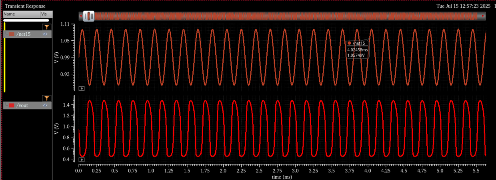

## Telescopic Op-Amp
Single-stage op-amp with stacked transistors for high gain. Consumes low power and provides high speed but has limited output swing. Suitable for high-speed, low-power applications. Requires precise biasing to maintain all MOSFETs in saturation.  

### Circuit
 

### AC Analysis
 

### Transient Analysis  
Input: 1 V ± ~70 mV sine wave.  
Output: Clean amplified sine wave (~0.4 V to 1.4 V) with no clipping or distortion. Output swing is limited but sufficient. Slight phase delay observed (normal in high-gain designs).  
  
