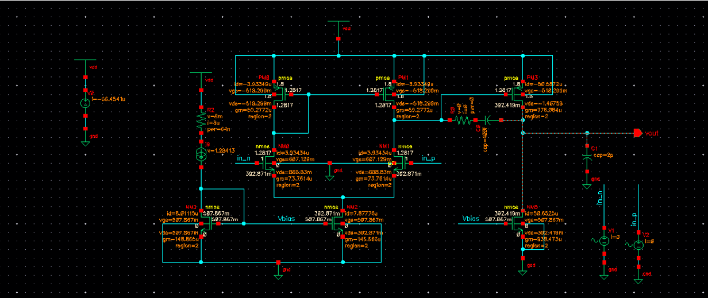
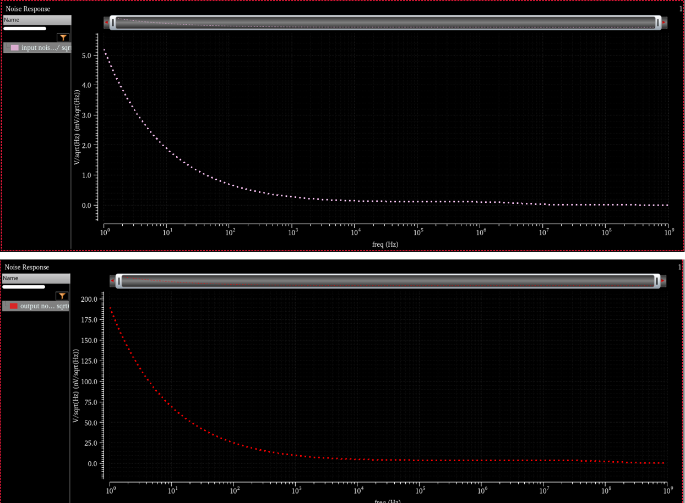

## Two-Stage Op-Amp
First stage: Differential amplifier with active load for high gain and CMRR.  
Second stage: Common-source amplifier to boost gain and provide output drive.  
Miller capacitor is used for compensation between the stages. Bias currents are set by current mirrors. Overall gain is the product of both stages, making it suitable for high-gain applications.  

### Circuit
 

### Symbol
 
 
### AC Analysis
  

### Noise Analysis  
- 1/f noise dominates at low frequencies (<10 kHz).  
- Thermal noise dominates at high frequencies (>100 kHz).  
- Input noise peaks at ~5 µV/sqrt(Hz) at low frequencies.  
- Output noise peaks at ~200 nV/sqrt(Hz) before flattening.  
- Noise performance is good in mid-to-high frequency range. 
   
  

### Transient Analysis  
Input: 1 V ± 100 mV sine wave (~10 kHz).  
Output: Clean amplified sine wave (~400 mV peak) with no distortion or clipping. Output tracks the input accurately with visible phase shift (expected for multi-stage op-amps).  
  

**Results Table:**  
| Parameter            | Value/Observation |
|----------------------|-------------------|
| Gain                 | 73.15 db |
| Bandwidth            | 4.953 KHz |
| UGB                  | 21.28 MHz |
| CMRR                 | 200.6 db |
| Slew Rate            | 39.12 MV/s |
| THD                  | 0.034% |
| Phase Margin         | 61.84° |
| Power Comsumption    | 113 µW |
| Offset Voltage Error | 4.98 µV |
| Noise                | 9.82e^-17 V/sqrt(Hz) |
| ICMR                 | 0.8V - 1.6V |
